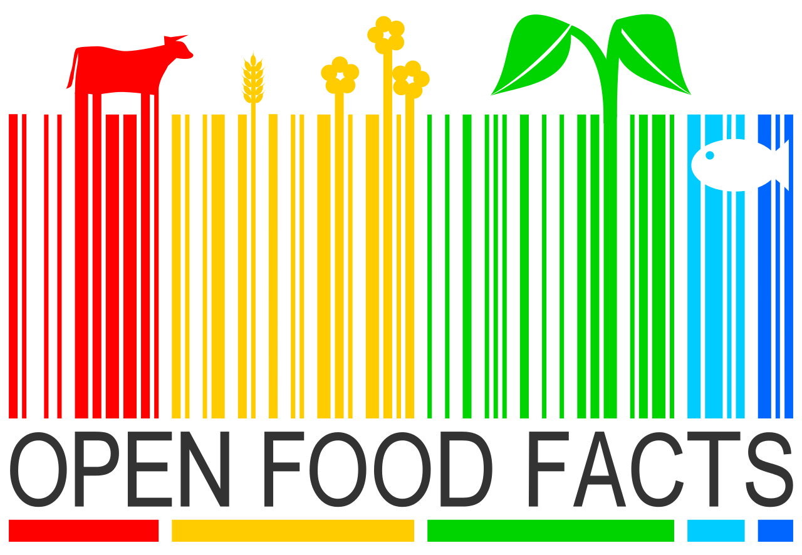

<!--Some CSS stuff for later-->

<body>
      

</body>

Are you Vegan ? Is this dish gluten-free ? These are the types of questions that made us all come to realize that what you eat has become a standardized normality. The no-meat, no-dairy, no-gluten regimes have become household names for either the medical need or the trendy conviction. In 2016, 0.8% of the french population was assumed to be intolerant to gluten, yet 7% regularly buy gluten-free products.* . This is an example of how food diets do not only emerge from individual medical conditions but also, and mainly, from collective trends through advertisement, accessibility, and media coverage.

**(Source : AFDIAG / AFP / SIAL 2016)*

In France, food diets have also been subject to households' attention over the last decade. Google Trends shows us how interest of these food diets was raised in France over these years. A value of 100 corresponds to the peak popularity of the term worldwide.  

 

Along with a modern rise of social and cultural movements, the adoption of new eating habits and debates around different food diets are topics to stay. So how does production react to new consumption tendencies ?

In this post we will dive into a data-driven analysis of how supermarkets have accustomed themselves to food diets through product <a href="#diversity" style="color:#159957"> diversity</a>, <a href="#nutrition" style="color:#159957">nutritional benefits</a>, and a short talk on product <a href="#packaging" style="color:#159957">
packaging</a>.

Our study is based on the public dataset <a href = "https://ch-fr.openfoodfacts.org/" style="color:#159957"> OpenFoodFacts</a>. <a href = "https://ch-fr.openfoodfacts.org/" style="color:#159957"> OpenFoodFacts</a> gathers more than a million products bought from supermarkets (mostly French) and scanned by over 15,000 users. The consumer can register product information such as its ingredients, nutitional intake, allergens, etc ...  We leverage this information to make a statistical examination of how diets are accounted for in the food-processing industry.

# Food Diversity

# Nutition Grade
Have you ever ask you the question if food products that you usually buy are healthy?

Table of nutritional values are mandatory on all prepackaged food presenting energy value, fat content, saturated fatty acids, carbohydrates, sugars, proteins and salt per 100g of product. But all these values are difficult to understand and to compare for the consumer. 

From 2016 Health law, the french government has recommended to set up a simple, readable and easily understandable graphic system, the Nutri-score.(lien)
The Nutri-score are letter grading products with A, B, C, D or E and colour informations. This allow to inform the consumer at the first time of purchase to include the nutrition dimension in the selection criteria and facilitate Health Professional advice on nutrition. Governments hope that system will encourage producers to improve the nutritional quality of products.

To class each products international research teams create the score with two dimensions: 'unfavourable' components, an excess of which is considered unhealthy: calories, sugars, sodium and saturated fatty acids and 'favourable' components: fruits, vegetables, pulses, nuts, and rapeseed, walnut and olive oils, protein and fibre, an adequate amount of which is considered healthy.

Since the creation of the Nutri-score more than 180 food industries (Danone, Bonduelle, McCain, Fleury Michon, Findus, Nestlé, Panzani …) and distributors (Leclerc, Auchan, Intermarché, Casino…) have committed to put the logo on their products.

For consumer the Nutri-score is used to compare the quality of foods from different categories (usually sugary snacks have worse grade than fruits or vegetables) or from same food offered by different brands. For example, breakfast cereals can have a score between A and E. At a glance, you can choose which of your favorite cereals have the best nutritional quality.

# Packaging

