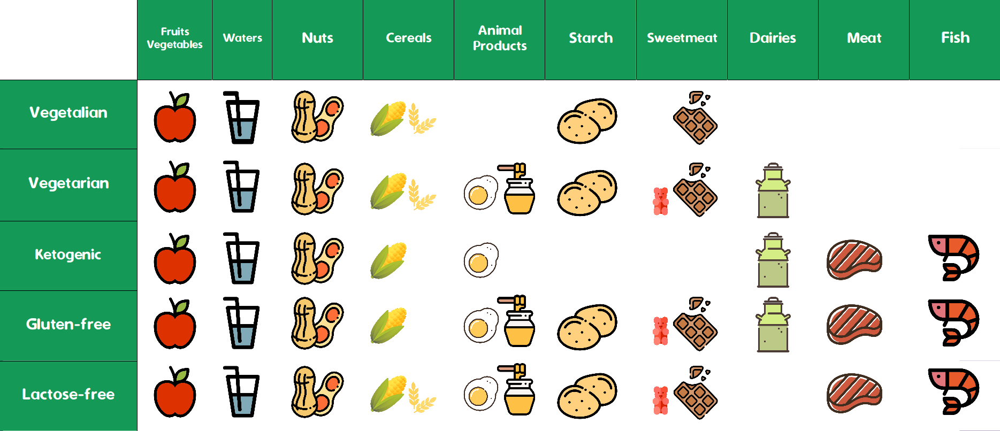
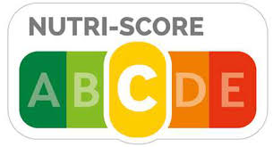

<body>
      

</body>

Are you Vegan ? Is this dish gluten-free ? These are the types of questions that made us all come to realize that what you eat has become a standardized normality. The no-meat, no-dairy, no-gluten regimes have become household names for either the medical need or the trendy conviction. In 2016, 0.8% of the french population was assumed to be intolerant to gluten, yet 7% regularly buy gluten-free products.* . This is an example of how food diets do not only emerge from individual medical conditions but also, and mainly, from collective trends through advertisement, accessibility, and media coverage.

**(Source : AFDIAG / AFP / SIAL 2016)*

In France, food diets have also been subject to households' attention over the last decade. Google Trends shows us how interest of these food diets was raised in France over these years. A value of 100 corresponds to the peak popularity of the term worldwide.  

 

Along with a modern rise of social and cultural movements, the adoption of new eating habits and debates around different food diets are topics to stay. So how does production react to new consumption tendencies ?

In this post we will dive into a data-driven analysis of how supermarkets have accustomed themselves to food diets through product <a href="#diversity" style="color:#159957"> diversity</a> and <a href="#nutrition" style="color:#159957">nutritional benefits</a>.

  

Our study is based on the public dataset <a href = "https://ch-fr.openfoodfacts.org/" style="color:#159957"> OpenFoodFacts</a>. <a href = "https://ch-fr.openfoodfacts.org/" style="color:#159957"> OpenFoodFacts</a> gathers more than a million products bought from supermarkets (mostly French) and scanned by over 15,000 users. The consumer can register product information such as its ingredients, nutitional intakes, allergens, etc ...  We leverage this information to make a statistical examination of how diets are accounted for in the food-processing industry.

# Diets

The different diets compared in this post are descibed in the following table 

<body>

      
      

</body>

They are all characterized by the restrictions on the consumption of certain food.

<ul>
  <li>Vegetalians abstain from the consumption of any animal product</li>
    <li>Vegetarians abstain from the consumption of meat</li>
  <li>Ketogenics favors high-fat, adequate-protein, low-carbohydrate food</li>
  <li> Gluten-free and Lactose-free diets strictly exclude the consumption of respectively gluten, a mixture of proteins found in wheat, and lactose, a sugar found in milk. </li>
</ul>

These diets represent the eating habits the most commonly adopted and for which the food industry should take into consideration.

# Food Diversity

The French National Nutrition and Health Program (PNNS) was last revised in 2016 and was created by a multi-sectoral committee made up of representatives from different ministries, national health agencies, public research institutes and other relevant groups. It aimed at establishing guidelines for eating healthy with daily recommendations for nutrition. For instance, it advocated the consumption of fruits and vegetables regardless of their form, foods that are rich in calcium, or starchy food, while limiting the intake of saturated fat or salt. The program introduced 7 main food categories : *Fish Meat and Eggs, Fruits and Vegetables, Dairies, Fat Sauces, Starchy, Snacks,* and *Beverages*.

We use these categories to classify the food products of our dataset as they were established by experts to present groups with homogenous nutritive compositions. It is to note that many food products, and most commonly in supermarkets, do not always clearly pertain to these 7 categories and are thus classfied to the one with most commonality.

The following interactive graph shows the percentage of products suitable for each diet over the whole set of 409,904 classified products.

<iframe width="900" height="450" frameborder="0" scrolling="no" src="//plot.ly/~romi514/5.embed?showlink=false&modebar=false&autosize=true"></iframe>

Different categories can be toggled on/off to only compare a subset among diets. The proportions observed may be slightly understated as product classification followed by diet classification is subject to small inaccuracies.

We observe that the proportions are relatively balanced with two diets less acounted for in products offered by supermarkets : Ketogenic and Vegetalian. These diets have more severe restrictions than the other diets considered for the study.

The gluten-free diet surprisingly prohibits the consumption of many meat, fish and eggs which can be easily transformed into more complex products containing derivatives of wheat.

The food industry thus still manages to offer a variety of products for each diet in each category that isn't a strict restriction for the diet in question. The inequalities of product availability in categories such as Starchy and Snacks give evidence of how basic products such as meat, milk, and wheat are transformed to create more complex products.

# Nutition Grade

Have you ever ask yourself the question if food products that you usually buy are healthy?

A table of nutritional values are mandatory on all prepackaged food and  display energy value, fat content, saturated fatty acids, carbohydrates, sugars, proteins and salt per 100g of product. But all these values are difficult to understand and to compare for the consumer. 

From 2016 Health law, the french government has recommended to set up a simple, readable and easily understandable graphic system, the <a href="https://www.santepubliquefrance.fr/determinants-de-sante/nutrition-et-activite-physique/articles/nutri-score" style="color:#159957">Nutri-score</a>.
The Nutri-score are A, B, C, D or E grades along with colour informations. This allows to inform the consumer of the nutritive value of the product and facilitate advice of health professionals on nutrition. Governments hope that this system will encourage producers to improve the nutritional quality of products.

To classify each product, international research teams create the score with two scoring mechanisms: a negative scoring, which accounts for what is considered unhealthy: calories, sugars, sodium and saturated fatty acids ... and positive scoring: fruits, vegetables, pulses, nuts, and rapeseed, walnut and olive oils, protein and fibre, in an adequate amount of which is considered healthy.

Since the creation of the Nutri-score, more than 180 food industries (Danone, Bonduelle, McCain, Fleury Michon, Findus, Nestlé, Panzani …) and distributors (Leclerc, Auchan, Intermarché, Casino…) have committed to put the logo on their products.

For consumers, the Nutri-score is used to compare the quality of food from different categories (usually sugary snacks have a worse score than fruits or vegetables) or from same food offered by different brands. For example, breakfast cereals can have a score between A and E. At a glance, you can choose which of your favorite cereals offer the best nutrition.

We compare the diets on the relative proportion of grade A, B, C, D, and E products for each food category.

<iframe width="900" height="450" frameborder="0" scrolling="no" src="//plot.ly/~romi514/9.embed?showlink=false&autosize=true&modebar=false"></iframe>

These plots show us that the global distribution of the nutriscore for different diets is the same. A diet choice should not affect the risk of dietary deficiencies or even the decrease in the nutitional quality of consummed food. Our bodily functions are similar, and our dietary needs are shared. The similar distributions come as a relief to the consumer as diet choices still give us equal choice in the quality of our food.

It is nonetheless important to note that Ketogenic and Glutenfree diets see less E-graded products proposed to them. This seems natural as low graded products often exhibit high quantities of sugar, salt, and gluten derivatives. The Ketogenic diet also offers substantially better product choices for Beverages.

The left-skewed distribution (heavy on for poor grades) holds us witness of the majority of poorly nutritious products of the large-scale food industry who emphasises quantity, cheap base products, and appealing packaging rather than more expensive nutrition.

# Conclusion

So how does an average supermarket treat its picky customers ?

The product offers made to different dietary regimes stay balanced and diversified in spite of strict food choices. The nutritional comparision between sold products also highlights balanced consumption choices throughout diets. 

However, the high commercialisation of sugary products does favor the Ketogenic regime overall as it aims to reduce the consumption of sugar.

