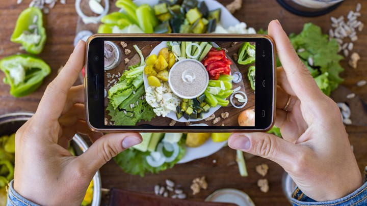

<body>
      

</body>

Are you Vegan ? Is this dish gluten-free ? These are the types of questions that made us all come to realize that what you eat has become a standardized normality. The no-meat, no-dairy, no-gluten regimes have become household names for either the medical need or the trendy conviction. In 2016, 0.8% of the french population was assumed to be intolerant to gluten, yet 7% regularly buy gluten-free products.* . This is an example of how food diets do not only emerge from individual medical conditions but also, and mainly, from collective trends through advertisement, accessibility, and media coverage.

**(Source : AFDIAG / AFP / SIAL 2016)*

In France, food diets have also been subject to households' attention over the last decade. Google Trends shows us how interest of these food diets was raised in France over these years. A value of 100 corresponds to the peak popularity of the term worldwide.  

 

Along with a modern rise of social and cultural movements, the adoption of new eating habits and debates around different food diets are topics to stay. So how does production react to new consumption tendencies ?

In this post we will dive into a data-driven analysis of how supermarkets have accustomed themselves to food diets through product <a href="#diversity">diversity</a>, <a href="#nutrition">nutritional benefits</a>, and a short talk on product <a href="#packaging">
packaging</a>.

# Food Diversity

# Nutition Grade

# Packaging

